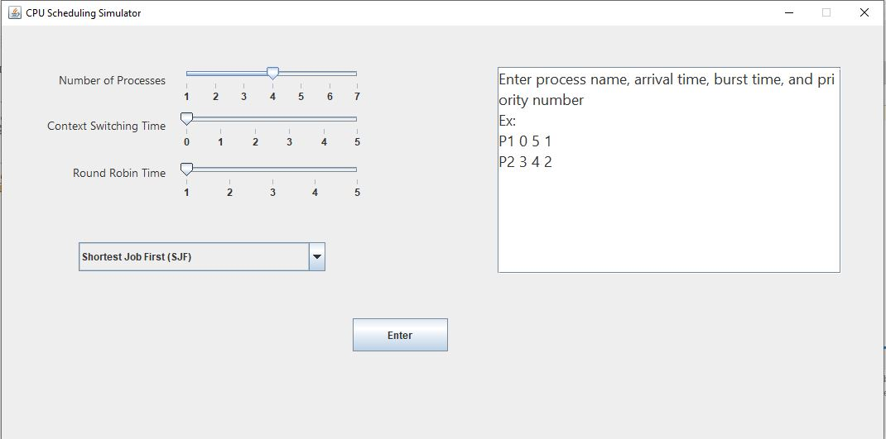
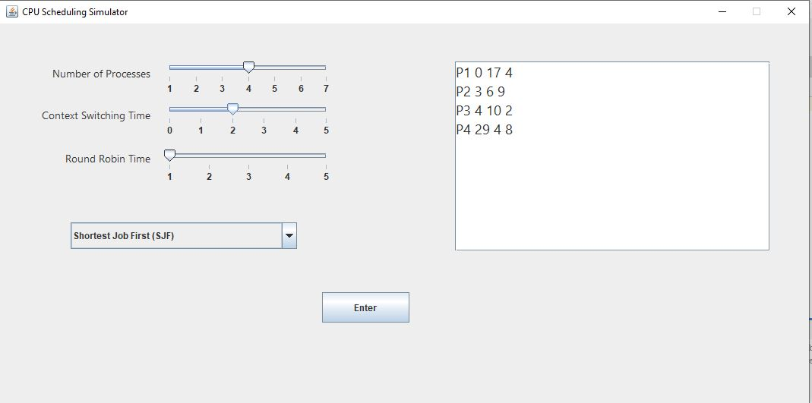
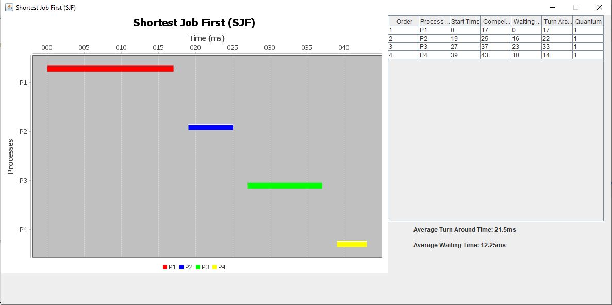
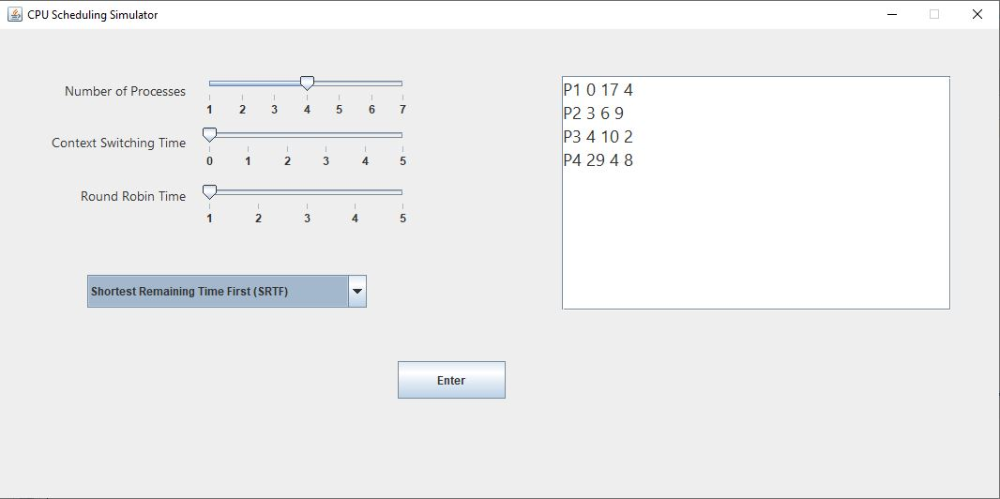
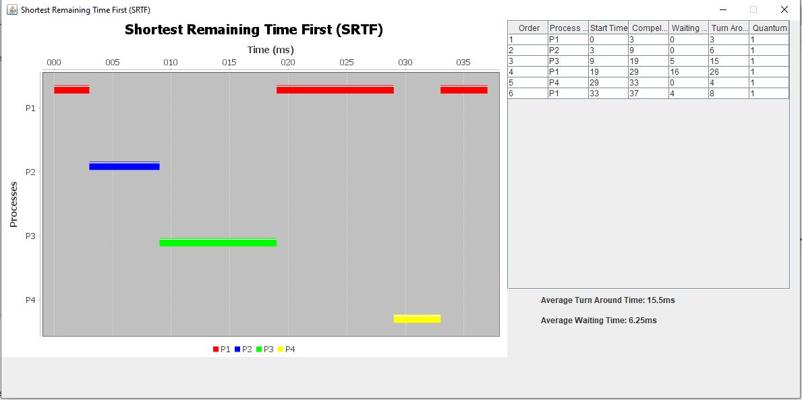
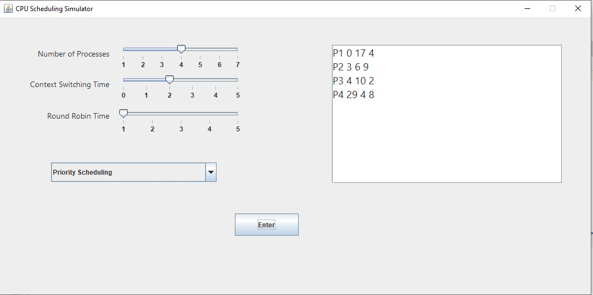
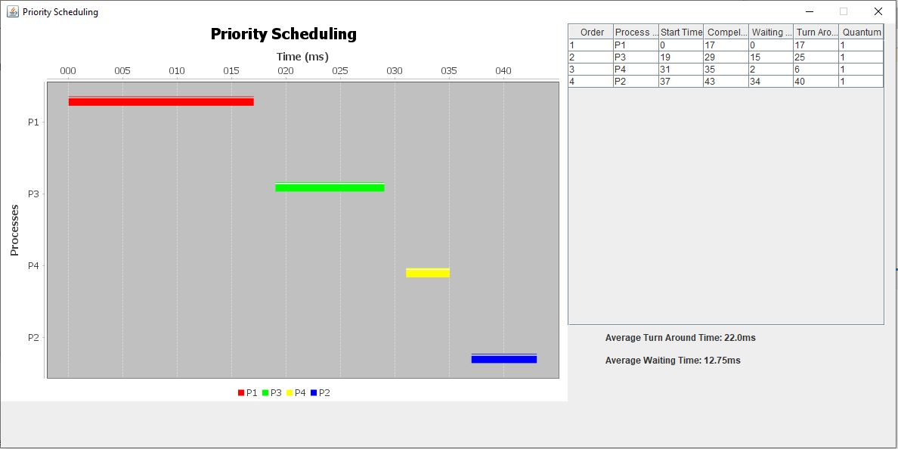
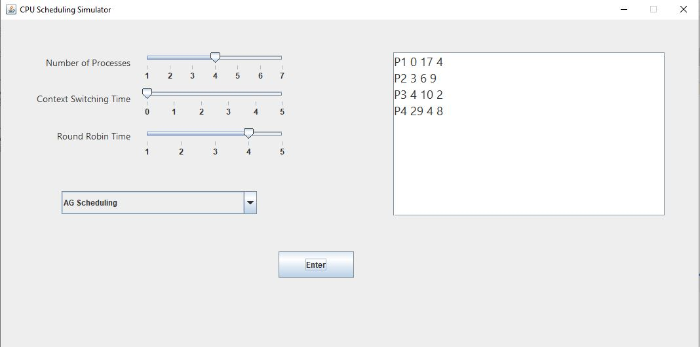
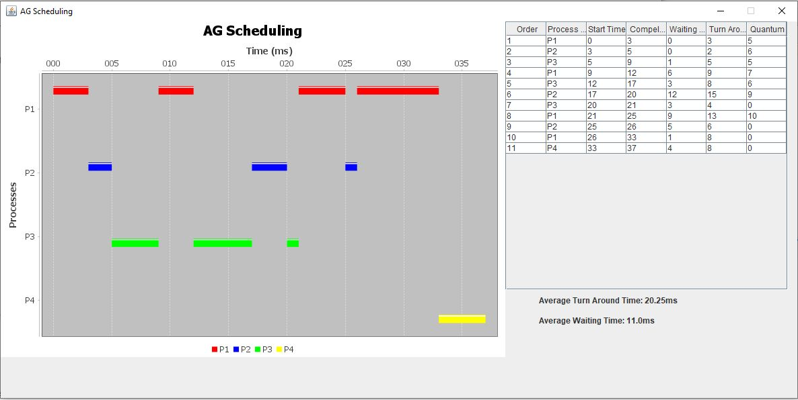

## CPU Scheduling Simulator
Scheduling is a fundamental operating system function. Almost all computer resources are scheduled before use. The CPU is, of course, one of the primary computer resources.
Thus, its scheduling is central to operating-system design. CPU scheduling determins which processes run when there are multiple run-able processes. CPU scheduling is important
becuase it can have a big effect on resource utilization and the overall performance of the system.

#### The following scheduling algorithms are implemented
1. Shortest-Job First (SJF): non-preemptive, context switching
2. Shortest-Remaining Time First (SRTF): preemptive, context switching
3. Priority Scheduling: non-preemptive, context switching
4. AG Scheduling:
   - AG-Factor = (Priority or 10 or random_function(0, 20)) + arrival time + burst time
     - if random_function < 10 -> AG-Factor = RF() + arrival time + burst time
     - if random_function > 10 -> AG-Factor = 10 + arrival time + burst time
     - if random_function = 10 -> AG-Factor = Priority + arrival time + burst time
   - The process is non-preemptive till it finish 50% of its quantum time, then it becomes preemptive
   - The 3 scenarios of the running process
     i. The running process used all its quantum time and it still have job to do (add this process to the end of the queue, then increases its quantum time by (ceil(10% of the (mean of quantum))))
     ii. The running process didn't use all its quantum time based on another process converted from ready to running (add this process to the end of the queue, and then increase its quantum time by the remaining unused quantum time of the process
     iii. The running process finished its job (set its quantum time to zero and remove it from ready queue and add it to the die list).

#### Input Example
(pr stands for process)
the input format for processes is like this: pr_name pr_color pr_arrival_time pr_burst_time pr_priority

#### ScreenShots
- Start Panel
  
  
- Shortest Job First (SJF)
  
  

- Shortest Remainging Time First (SRTF)
  
  

- Priority Schedulling
  
  

- AG Schedulling
  
  
